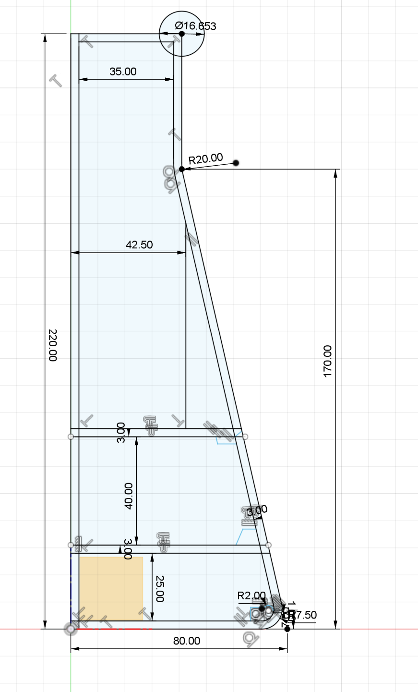

# Erlemeyer

## Concept

## Design

The following design was made in Fusion360.

## Electronics

## Color Scenes

| Mode Name | Description |
|-----------|-------------|
|  OFF   |  Tamelijk veel animatie; versterkend en verzwakkende gloed; altijd paars.  |
|  SPEAKING   |  Tamelijk veel animatie; versterkend en verzwakkende gloed; altijd paars.  |
|  IDLE   |  Licht faden, altijd paars, niet heel actief.  |
|  RED-SOLID   |  Licht faden, altijd paars, niet heel actief.  |
|  GREEN-SOLID   |  Licht faden, altijd paars, niet heel actief.  |
|  BLUE-SOLID   |  Licht faden, altijd paars, niet heel actief.  |