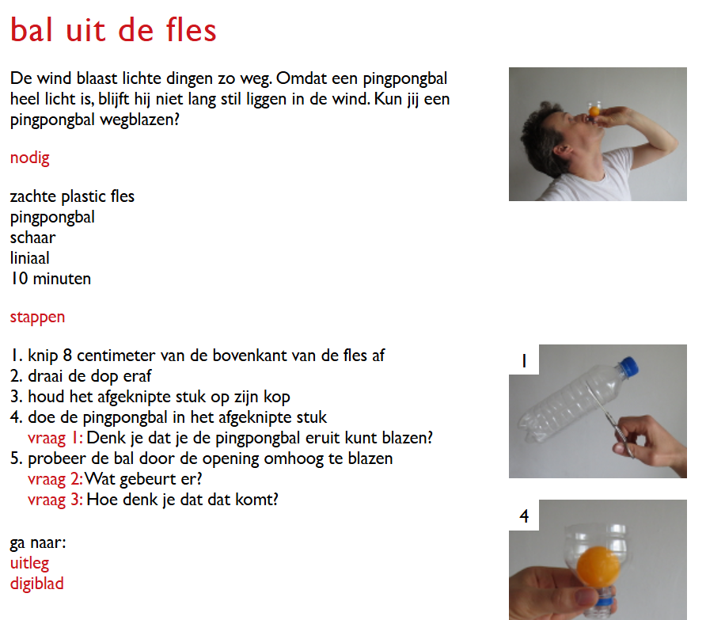

- **vulkaan**
- **elephant toothpaste**
- **Statische elektriciteit (Van de Graaff-generator)**: Laat een vrijwilliger op een isolerend krat staan met de hand op de bol. Het haar vliegt spectaculair omhoog zodra het apparaat aangaat.
- **Fluorescerende vloeistoffen (UV-licht)**: Gebruik tonic (bevat kinine) of de vulling van een geelstift opgelost in water. Onder UV-lampen lichten de vloeistoffen fel op als magische elixers.
- **Lycopodium-vuurbal**: Blaas een klein beetje sporenpoeder (Lycopodium) door een vlam heen voor een gecontroleerde, flitsende vuurbal. Let op: Alleen uitvoeren met de juiste veiligheidsmaatregelen.
- **Jodiumklokreactie (Iodine Clock)**: Meng twee transparante vloeistoffen. Terwijl je aftelt met het publiek, gebeurt er ogenschijnlijk niets — tot de vloeistof in exact één seconde omslaat naar diepdonkerblauw. Het 'plotselinge' effect werkt geweldig op een podium.

[stevespangler experiments](https://stevespangler.com/experiments/)

[proefjes.nl](https://www.proefjes.nl/alleproefjes.php)

